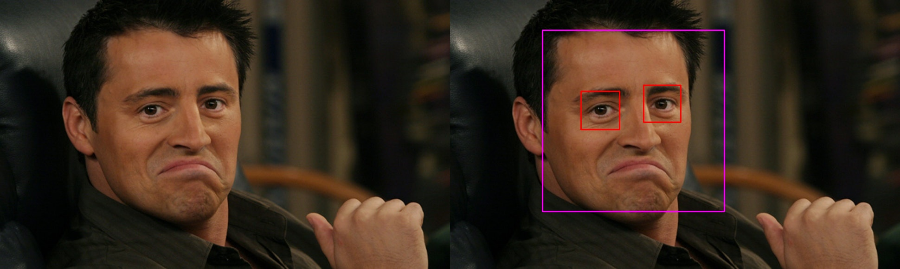

===============
Getting started
===============

Installation
------------

It can be installed through pip:

.. code:: bash

    pip3 install --user cv2utils

This implementation requires OpenCV and Numpy.

Usage
-----

OpenCV Face DNN
###############

The following example illustrates the ease of use of this package:

.. code-block:: python

    >>> import cv2
    >>> from cv2utils import FaceDnn
    >>> image = cv2.imread("face.jpg")
    >>> detector = FaceDnn()
    >>> detector.detect_faces(image)
    [{'label': 'face', 'confidence': 0.9966524243354797, 'box': [210, 64, 522, 465]}]

The detector returns a list of dict objects. Each dict object contains three main keys: 'box', 'confidence' and 'label':

* The bounding **box** is formatted as [x_initial, y_initial, x_final, y_final] under the key 'box'.
* The **confidence** is the probability estimate for a bounding box to be matching the label under the key 'confidence'.
* The **label** identifies which object is detecting under the key 'label'.

Look the file `result_dnn.py <https://github.com/luizcarloscf/cv2utils/blob/master/examples/result_dnn.py>`__ to see how the image below was generated.

.. image:: ../examples/images/result_dnn.jpg
    :align: center
    :target: https://github.com/luizcarloscf/cv2utils/blob/master/examples/images/result_dnn.jpg
    :alt: Result DNN

OpenCV Face Cascade and Eye Cascade
###################################

The following example illustrates the ease of use of this package:

.. code-block:: python

    >>> import cv2
    >>> from cv2utils import FaceCascade, EyeCascade
    >>> image = imread("face.jpg")
    >>> face_detector = FaceCascade()
    >>> faces = face_detector.detect_faces(image)
    >>> faces
    [{'label': 'face', 'box': [199, 65, 591, 457]}]
    >>>
    >>> [x,y,x_final,y_final] = faces[0]['box']
    >>> eye_detector = EyeCascade()
    >>> eye_detector.detect_eyes(image[y:y_final, x:x_final])
    [{'label': 'eye', 'box': [83, 132, 166, 215]}, {'label': 'eye', 'box': [218, 119, 298, 199]}]

The detector returns a list of DICTIONARY objects. Each DICTIONARY object contains two main keys: 'box', 'label':

* The bounding **box** is formatted as [x_initial, y_initial, x_final, y_final] under the key 'box'.
* The **label** identifies which object is detecting.

Look the file `result_cascade.py <https://github.com/luizcarloscf/cv2utils/blob/master/examples/result_cascade.py>`__ to see how the image below was generated.

