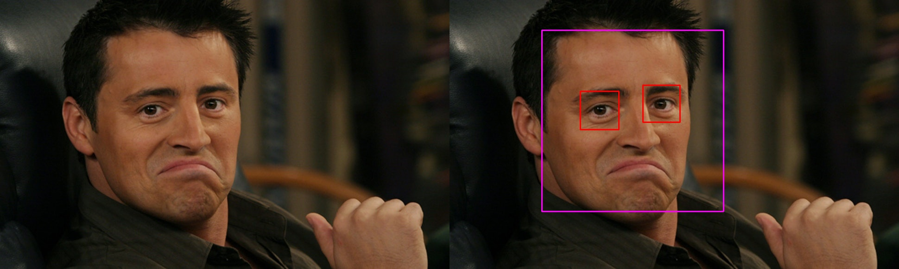
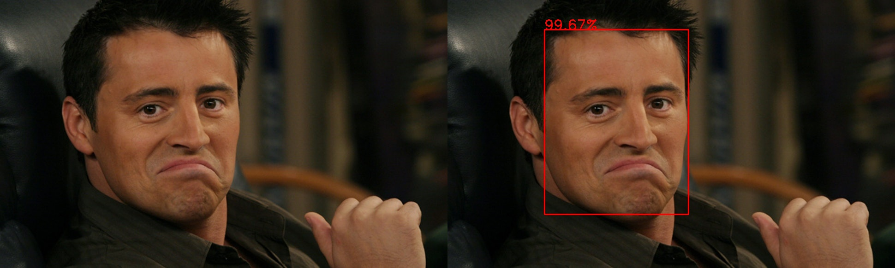

.. cv2utils documentation master file, created by
   sphinx-quickstart on Sun Mar 22 12:45:23 2020.
   You can adapt this file completely to your liking, but it should at least
   contain the root `toctree` directive.

cv2utils
========

.. image:: https://img.shields.io/pypi/v/cv2utils.svg?label=cv2utils
    :target: https://pypi.org/project/cv2utils
    :alt: PyPI 

.. image:: http://img.shields.io/travis/luizcarloscf/cv2utils/master.svg?label=linux
    :target: https://travis-ci.com/luizcarloscf/cv2utils
    :alt: Travis

.. image:: https://readthedocs.org/projects/cv2utils/badge/?version=latest
    :target: https://cv2utils.readthedocs.io/en/latest/?badge=latest
    :alt: Documentation Status

.. image:: https://img.shields.io/pypi/dm/cv2utils
    :target: https://pypi.org/project/cv2utils
    :alt: PyPI - Downloads

.. image:: https://img.shields.io/badge/license-MIT%20-blue.svg
    :target: https://github.com/luizcarloscf/cv2utils/LICENSE

Implementation of some object detection in Python3.5+. It is included in this project:

* Face and Eye detection using OpenCV Haar feature-based cascade classifiers.

* Face detection using OpenCV Deep Neural Networks

.. toctree::
   :maxdepth: 1
   :caption: Contents:

   
   
   api
   getting_started
   license
   Source Code on GitHub <https://github.com/luizcarloscf/cv2utils>

.. Indices and tables
.. ==================

.. * :ref:`genindex`
.. * :ref:`modindex`
.. * :ref:`search`
